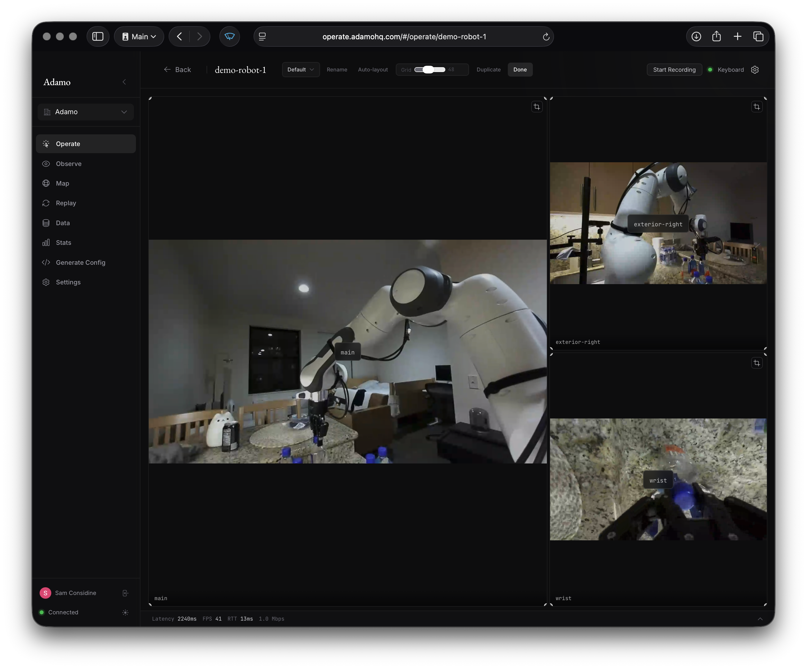
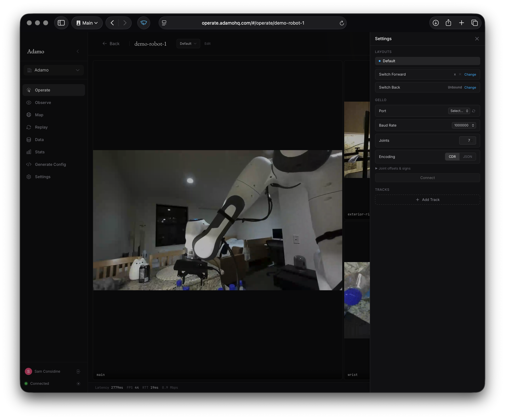
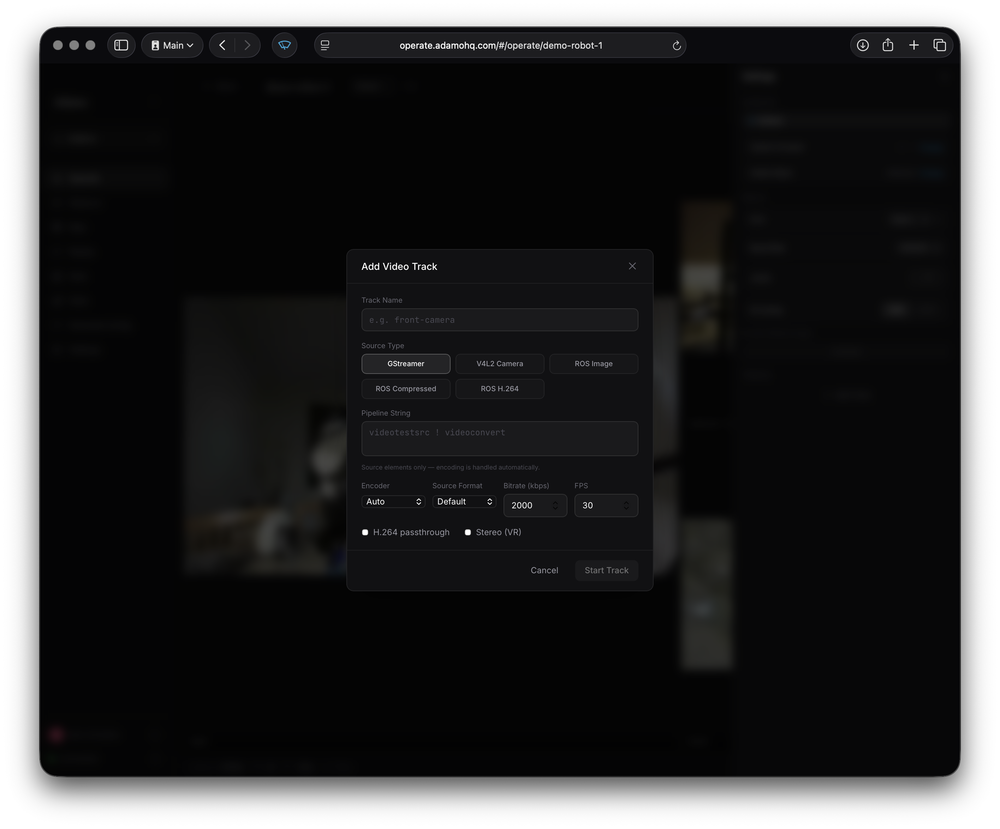
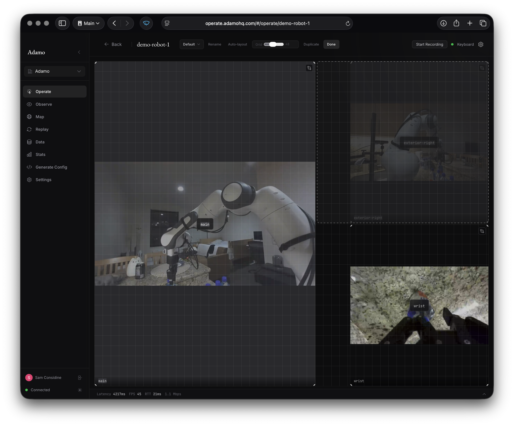
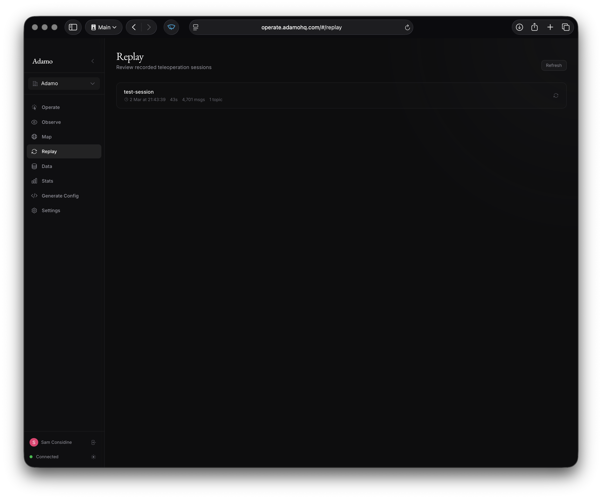
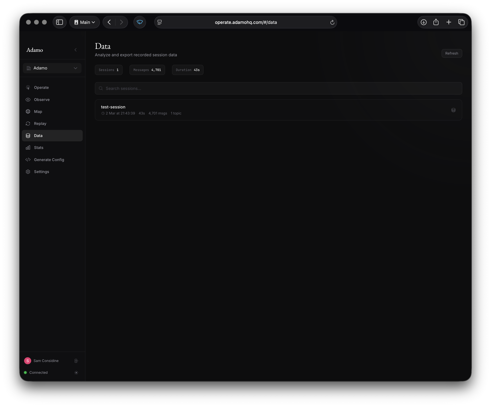
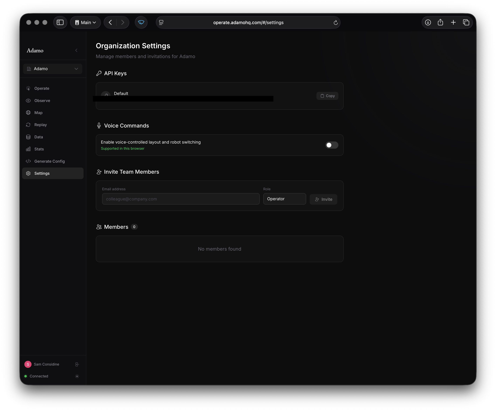

The Adamo web app at [operate.adamohq.com](https://operate.adamohq.com) is where you view video streams, control robots, and manage your fleet.

## Logging In

Go to [operate.adamohq.com](https://operate.adamohq.com) and sign in with Google. If you belong to multiple organizations, you'll be prompted to select one.

{/* TODO: Add login page screenshot */}

## Robot Grid

After logging in, you'll see a grid of your robots. Each card shows a live video thumbnail, the robot name, and a status badge (LIVE or IDLE). A search bar filters robots by name.

Click a robot to enter the teleoperation view.

## Teleoperation View

This is where you operate a robot. The main area is a camera grid showing all active video streams.

### Video Streams

Video streams display in a configurable grid layout. If the robot has multiple tracks (e.g., "front", "rear", "depth"), they all appear simultaneously. Lidar tracks render as interactive 3D point clouds instead of video.

### Stereo / VR

Stereo video tracks have a "View Stereo" button that launches an immersive WebXR VR view. Head pose and VR controller positions are tracked and forwarded to the robot as control topics (see [Control](/control/)).

### Control Panel

A collapsible panel at the bottom shows stream stats (latency, FPS, RTT, bitrate) and input method status. Expand it for detailed metrics and to switch between input methods (Gamepad or GELLO).

### Adding Tracks

Click "Add Track" to dynamically start a new video track on the robot without editing the config file. You can configure the source type, encoder, bitrate, and FPS from the dialog.

## Layouts

Layouts control how camera panels are arranged in the grid. You can create multiple layouts and switch between them.

### Editing Layouts

Enter edit mode from the layout toolbar. In edit mode you can:

- **Drag** panels to reposition them on the grid
- **Resize** panels from corners and edges
- **Crop** panels to show a sub-region of the video
- **Adjust grid fineness** (12 to 96 columns) for precise placement

Unplaced cameras appear as buttons you can click to add them to the layout.

### Switching Layouts

Switch layouts from the toolbar dropdown, with a gamepad button binding, or with voice commands ("next layout", "layout X").

## Observe Mode

Observe mode (`/observe`) shows the same camera grid and layouts but without any control capabilities. Use this for monitoring without the risk of sending accidental inputs.

## Recording & Replay

Start a recording from the teleoperation view using the record button in the header. A red indicator and duration timer show that recording is active.

Recorded sessions appear on the Replay page (`/replay`) where you can play back video with transport controls (play, pause, seek) and a timeline scrubber.

## Data

The Data page (`/data`) lets you explore recorded sessions in detail:

- **Topic list** — browse recorded topics by category (video, control, sensor)
- **Density timeline** — visualize message density over time, drag to select a time range
- **Data tiles** — composable grid of visualizations (video playback, sparklines, message rate, raw message inspector)
- **Export** — download data as CSV or access it programmatically via curl

## Map

The Map page (`/map`) shows robot locations on a geographic map. Robot markers indicate streaming status. Click a marker to jump to the observe view for that robot.

## Fleet Stats

The Stats page (`/stats`) shows fleet-wide performance metrics: CPU, memory, latency, temperature, battery, and uptime for each robot. Click a row to expand sparkline charts for each metric over time.

## Settings

The Settings page includes:

- **API Keys** — view and copy your organization's API keys
- **Team Members** — invite members by email with role assignment (owner, admin, developer, operator)
- **Pending Invitations** — manage sent invites
- **Voice Commands** — enable/disable voice control for layout and robot switching
